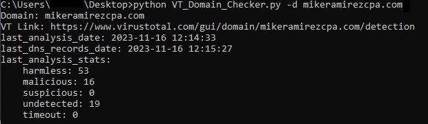
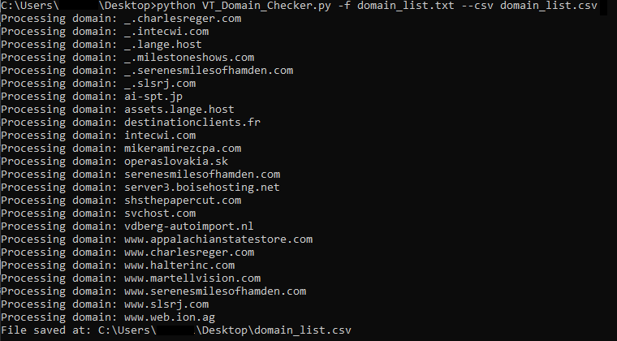
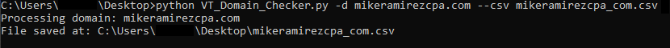

# VT Domain Checker
Python script to quickly check domain in question to VT

## Instructions
1.	Replace <API_KEY> with your VT API key
2.	To check single domain, run: python VT_Domain_Checker.py -d [domain]
3.  To check multiple domain, run: python VT_Domain_Checker.py -f [filename]
4.  IF you want to save the output into csv, append "--csv" at the end: python VT_Domain_Checker.py -d [domain] or -f [filename] [--csv filename.csv]

* I'm running this script on Python 3.12.0

## Screenshots
<kbd></kbd>

Figure 1 - To check single domain.

<kbd></kbd>

Figure 2 - To check multiple domain.

<kbd></kbd>

Figure 3 - To save output to csv file.

## Changelogs
* v1.0   (16 Nov 2023): First version of the script.
